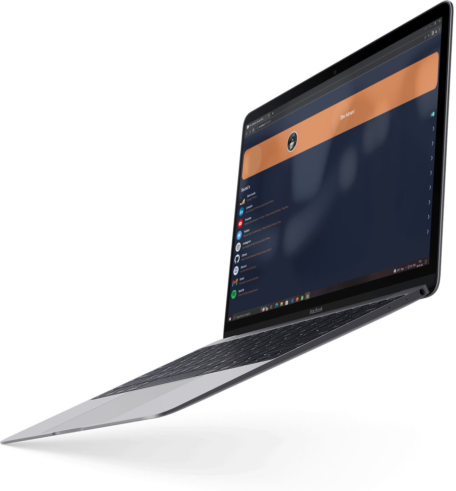
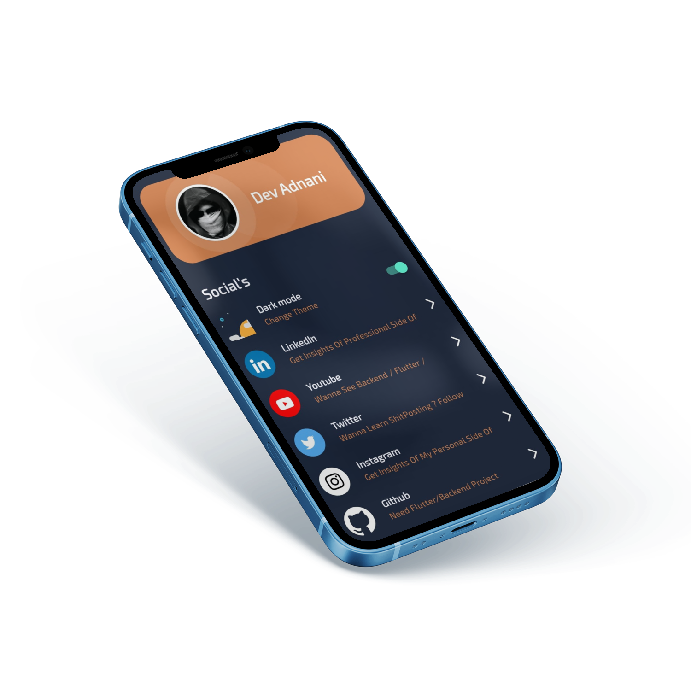
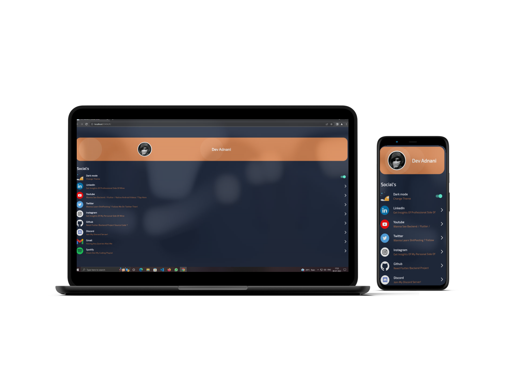

# LinkIT

- Your personalized social cards. Put your social medias link in one place. Easy peasy!

  

## Demo

Web : https://social.devadnani.com/

## Note

- Wanna Change It To Your Link?
  - For Adding Your Links & Profile Image
  - Navigate To -> Lib Folder -> App Folder -> Constants Folder -> app.social.links.dart -> Change Links Over There

## Features

- Login / Sign Up

## Libraries

- Main Library Used in App     
    - Provider
    - Shared Preferences
    - Url Strategy

## Screenshots

- All Screens 

Screen 1               |  Screen 2  | Screen 3                            
:-------------------------:|:-------------------------:|:-------------------------:
||

## Feedback

If you have any feedback, please reach out to us at dev.adnani26@gmail.com

